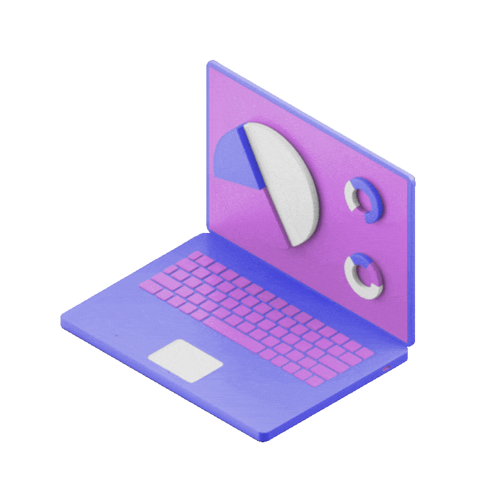

  <kbd>
    
  </kbd>

  
> **⟢ 𝑴𝑪𝑨 𝑮𝒓𝒂𝒅𝒖𝒂𝒕𝒆 𝒃𝒖𝒊𝒍𝒅𝒊𝒏𝒈 𝒔𝒐𝒇𝒕𝒘𝒂𝒓𝒆 𝒘𝒊𝒕𝒉 𝑱𝒂𝒗𝒂, 𝑴𝑬𝑹𝑵 𝑭𝒖𝒍𝒍-𝑺𝒕𝒂𝒄𝒌 & 𝑪𝒍𝒐𝒖𝒅 ⟣**

🔭 𝗜’𝗺 𝗰𝘂𝗿𝗿𝗲𝗻𝘁𝗹𝘆 𝘄𝗼𝗿𝗸𝗶𝗻𝗴 𝗼𝗻  
Neo Skylark – AI-Powered Tactical Drone Marketplace〖 𝗔𝗰𝗮𝗱𝗲𝗺𝗶𝗰 𝗣𝗿𝗼𝘁𝗼𝘁𝘆𝗽𝗲 〗 
https://github.com/k-vithalw/neo-skylark

📄 𝗞𝗻𝗼𝘄 𝗮𝗯𝗼𝘂𝘁 𝗺𝘆 𝗲𝘅𝗽𝗲𝗿𝗶𝗲𝗻𝗰𝗲𝘀 (RESUME)  
https://drive.google.com/file/d/your-resume-link/view 

🌱 𝗜’𝗺 𝗰𝘂𝗿𝗿𝗲𝗻𝘁𝗹𝘆 𝗹𝗲𝗮𝗿𝗻𝗶𝗻𝗴  
Java • Data Structures & Algorithms 

💬 𝗔𝘀𝗸 𝗺𝗲 𝗮𝗯𝗼𝘂𝘁  
Java Basics • Full Stack Learning Journey • Neo Skylark

   

    
  

&nbsp;&nbsp;

&nbsp;&nbsp;

&nbsp;&nbsp;

&nbsp;&nbsp;

&nbsp;&nbsp;

&nbsp;&nbsp;

&nbsp;&nbsp;

  
  

# 💻 Learning Tech-Stack:
                         

  
  

&nbsp;&nbsp;&nbsp;
 

<h3 align="center">╭───────────────────────── 💫 𝗔𝗯𝗼𝘂𝘁 𝗠𝗲  ─────────────────────────╮</h3>

𝖨 𝖺𝗆 𝖺𝗇 𝖬𝖢𝖠 𝖦𝗋𝖺𝖽𝗎𝖺𝗍𝖾 𝗉𝗎𝗋𝗌𝗎𝗂𝗇𝗀 𝖺 𝗉𝗋𝗈𝖿𝖾𝗌𝗌𝗂𝗈𝗇𝖺𝗅 𝖼𝖺𝗋𝖾𝖾𝗋 𝗂𝗇 𝗦𝗼𝗳𝘁𝘄𝗮𝗿𝗲 𝗘𝗻𝗴𝗶𝗻𝖾𝖾𝗋𝗂𝗇𝗀, 𝗐𝗂𝗍𝗁 𝖺 𝗌𝗍𝗋𝗈𝗇𝗀 𝗂𝗇𝗍𝖾𝗋𝖾𝗌𝗍 𝗂𝗇 𝗝𝗮𝘃𝗮, 𝗕𝗮𝗰𝗸𝗲𝗻𝗱 𝗗𝗲𝘃𝗲𝗹𝗼𝗽𝗺𝗲𝗻𝘁, 𝗠𝗘𝗥𝗡 𝗙𝘂𝗹𝗹 𝗦𝘁𝗮𝗰𝗸, 𝖺𝗇𝖽 𝗖𝗹𝗼𝘂𝗱 𝗧𝗲𝗰𝗵𝗻𝗼𝗹𝗼𝗴𝗶𝖾𝗌. 𝖨 𝖿𝗈𝖼𝗎𝗌 𝗈𝗇 𝗉𝗋𝖺𝖼𝗍𝗂𝖼𝖺𝗅 𝗅𝖾𝖺𝗋𝗇𝗂𝗇𝗀, 𝗂𝗆𝗉𝗋𝗈𝗏𝖾𝗆𝖾𝗇𝗍, 𝖺𝗇𝖽 𝖻𝗎𝗂𝗅𝖽𝗂𝗇𝗀 𝗐𝖾𝗅𝗅-𝖽𝗈𝖼𝗎𝗆𝖾𝗇𝗍𝖾𝖽, 𝗂𝗇𝗍𝖾𝗋𝗏𝗂𝖾𝗐-𝖽𝖾𝖿𝖾𝗇𝗌𝗂𝖻𝗅𝖾 𝗉𝗋𝗈𝗃𝖾𝖼𝗍𝗌.

𝖢𝗎𝗋𝗋𝖾𝗇𝗍𝗅𝗒, 𝖨 𝖺𝗆 𝖽𝖾𝗏𝖾𝗅𝗈𝗉𝗂𝗇𝗀 **𝗡𝗲𝗼 𝗦𝗸𝘆𝗹𝗮𝗿𝗸**, 𝖺𝗇 𝖠𝖨-𝖯𝗈𝗐𝖾𝗋𝖾𝖽 𝖳𝖺𝖼𝗍𝗂𝖼𝖺𝗅 𝖣𝗋𝗈𝗇𝖾 𝖬𝖺𝗋𝗄𝖾𝗍𝗉𝗅𝖺𝖼𝖾, 𝖺𝗌 𝖺𝗇 𝖺𝖼𝖺𝖽𝖾𝗆𝗂𝖼 𝖿𝗎𝗅𝗅-𝗌𝗍𝖺𝖼𝗄 𝗉𝗋𝗈𝗍𝗈𝗍𝗒𝗉𝖾. 𝖨 𝖻𝖾𝗅𝗂𝖾𝗏𝖾 𝗂𝗇 𝗁𝗈𝗇𝖾𝗌𝗍 𝗉𝗋𝗈𝗃𝖾𝖼𝗍 𝗉𝗋𝖾𝗌𝖾𝗇𝗍𝖺𝗍𝗂𝗈𝗇, 𝖼𝗈𝗇𝗍𝗂𝗇𝗎𝗈𝗎𝗌 𝗅𝖾𝖺𝗋𝗇𝗂𝗇𝗀, 𝖺𝗇𝖽 𝖻𝗎𝗂𝗅𝖽𝗂𝗇𝗀 𝗌𝖼𝖺𝗅𝖺𝖻𝗅𝖾 𝗌𝗈𝖿𝗍𝗐𝖺𝗋𝖾 𝗌𝗈𝗅𝗎𝗍𝗂𝗈𝗇𝗌 𝗐𝗂𝗍𝗁 𝖺 𝗅𝗈𝗇𝗀-𝗍𝖾𝗋𝗆 𝗀𝗈𝖺𝗅 𝗈𝖿 𝖻𝖾𝖼𝗈𝗆𝗂𝗇𝗀 𝖺 𝗖𝗹𝗼𝗎𝖽 𝖠𝗋𝖼𝗁𝗂𝗍𝖾𝖼𝗍.

<h3> ◆ 𝗖𝗮𝗿𝗲𝗲𝗿 𝗚𝗼𝗮𝗹 • Software Engineer → Backend → DevOps → Cloud Architect</h3>

> **◈ <ins>𝑷𝒓𝒐𝒋𝒆𝒄𝒕 𝑷𝒓𝒆𝒗𝒊𝒆𝒘 : 🔗 𝑳𝒊𝒏𝒌</ins> ◈**  
>⫷ 𝗡𝗲𝗼 𝗦𝗸𝘆𝗹𝗮𝗿𝗸  𝑨𝑰-𝑷𝒐𝒘𝒆𝒓𝒆𝒅 𝑻𝒂𝒄𝒕𝒊𝒄𝒂𝒍 𝑫𝒓𝒐𝒏𝒆 𝑴𝒂𝒓𝒌𝒆𝒕𝒑𝒍𝒂𝒄𝒆 ⫸ ❰ 𝑨𝒄𝒂𝒅𝒆𝒎𝒊𝒄 𝑷𝒓𝒐𝒕𝒐𝒕𝒚𝒑𝒆 ❱

<h3 align="center">╰─────────────────────────────────────────────────────────────╯</h3>
